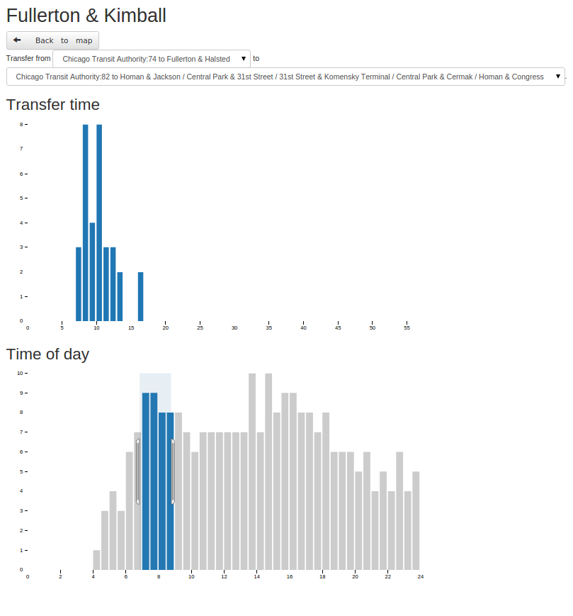

# connection-plotter: examine pulsing patterns in transit systems

Connection-plotter is a tool to look at [pulsing](http://www.humantransit.org/2010/12/basics-finding-your-pulse.html) in transit
systems by looking at connection time distributions. It uses [OpenTripPlanner](http://opentripplanner.org) to perform
the graph theory tasks, and creates the distributions on the client side.

A similar tool to look at aggregate distributions is [Pulsar](https://github.com/conveyal/pulsar).

## How to use it

You'll need an OTP server with a transit graph built and loaded in long-distance mode.

Edit client/config/config.js and input the URL of your OTP server. I recommend running it on the same host so that you
don't have to worry about same-origin issues.

Build the javascript files by typing `component build -d`, and then serve the files however you prefer.

Open up the app in a browser; all the stops load. Click on one. You're taken to a page where you can see all the routes
that run through that stop, and all the lines you can transfer to. Select a source and destination line; histograms will
display with transfer times and arrivals by time of day. Drag over either histogram to filter the other (for instance,
  you could see what transfer times are like in the morning peak, or when 10 minute transfers occur.)

## Use with multiple scenarios

It is possible to use Pulsar with an OTP server with multiple routers. Just add #routerid to the url when you first open
the app.
